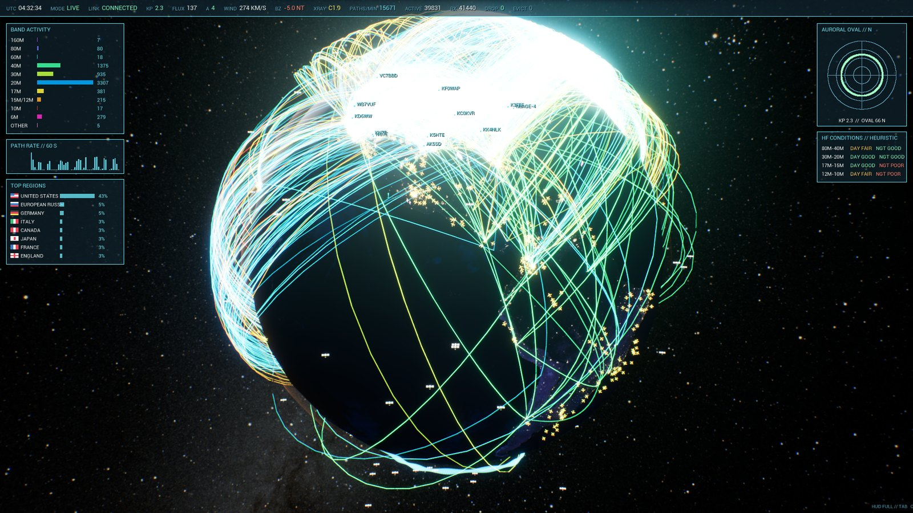
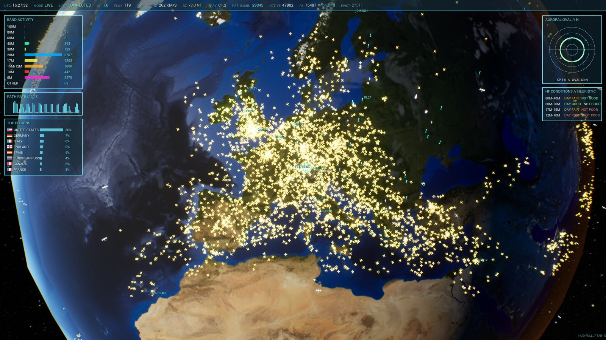
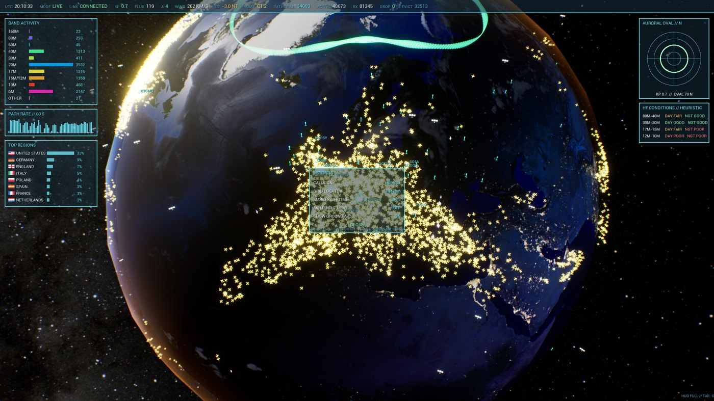

# ION COMMAND

**A live situation display for the sky above you.**

ION COMMAND puts real-time HF propagation, aircraft, lightning, satellites,
earthquakes, ionosphere soundings and space weather on one photoreal globe —
a mission-control wall you can actually read.



It is two pieces: a **Go collector** that speaks to a dozen public data
services and normalises everything into one canonical event format, and an
**Unreal Engine 5 client** that renders it. The core is deliberately generic —
the globe knows about *points*, *paths* and *domains*, not about callsigns —
so a new data source is a plugin, not a rewrite.

Status: **pre-1.0**, Windows x64, single-operator local use. MIT licensed.

---

## What you see

| Layer | Source | What it tells you |
| --- | --- | --- |
| **Propagation paths** | PSKReporter, Reverse Beacon Network, WSJT-X | Who is hearing whom right now, coloured by band. Press **M** for just your own station's RX/TX. |
| **Aircraft** | OpenSky (worldwide) + adsb.lol (regional detail) | Thousands of airframes, oriented on their true track and gliding between updates. Type-specific glyphs for airliners, helicopters, gliders, balloons and drones; emergency squawks turn red. |
| **Lightning** | Blitzortung | Individual strikes as they happen. [Please read the note](docs/DATA-SOURCES.md#a-word-about-blitzortung) — it is a volunteer network, non-commercial only, and not a warning system. |
| **Satellites** | CelesTrak TLEs, SGP4-propagated | Amateur satellites at true orbital altitude. |
| **Earthquakes** | USGS | Recent quakes, sized by magnitude. |
| **Ionosphere** | GIRO / KC2G soundings | foF2 and MUF per station, feeding a hop-by-hop path analysis. |
| **Space weather** | NOAA SWPC + GOES | Kp, solar flux, A-index, solar wind, Bz, X-ray flare class, and an aurora oval that grows with Kp. |
| **Clouds** | EUMETSAT world IR composite | The actual weather of the last hour, refreshed hourly. |
| **Sky** | NASA SVS Deep Star Map | The real celestial sphere, rotated to current sidereal time. |

The cockpit HUD adds band activity, a path-rate sparkline, top DXCC regions
with flags, an auroral oval dial, an HF conditions estimate and a hop/MUF
analysis for whatever path you click.

**What it is not:** the analysis panels are labelled `// HEURISTIC` for a
reason. The HF conditions verdict is a rule of thumb, not a NOAA forecast, and
the arcs are *reported reception links*, not measured ray paths.



## Install (Windows)

1. Download `ION-COMMAND-<version>-Setup.exe` from
   [Releases](https://github.com/svabi79/ion-command/releases).
2. Run it. Windows SmartScreen will warn about an unsigned binary — the
   installer is not code-signed. Choose *More info → Run anyway* if you are
   comfortable with that.
3. Launch **ION COMMAND** from the Start Menu. The collector starts
   automatically and the globe fills within seconds.

Requires 64-bit Windows 10 or later, a GPU that can run UE5, ~1.5 GB of disk
and an internet connection. The collector listens on `127.0.0.1:7810` only.

**Set your station:** press **O**, click **SETTINGS >**, then click the
CALLSIGN and GRID LOCATOR rows and type. Your position appears as a green
"you are here" reticle and unlocks the *MY RX/TX* filter.



## Controls

| Key | Action | | Key | Action |
| --- | --- | --- | --- | --- |
| **O** | overlay menu | | **Tab** | HUD: full / minimal / off |
| **V** | show/hide paths | | **M** | only my station's paths |
| **H** | activity heatmap | | **I** | ionosphere shells |
| **N** | cycle mode filter | | **F** | focus selection |
| **1–9 / 0** | band presets / all | | **Space** | pause timeline |
| **R** | replay last 15 min | | **L** | back to live |
| **Wheel** | zoom | | **RMB** | orbit |

Hover any marker for details; click a path for distance, azimuth, grayline and
a hop-by-hop MUF verdict. Full reference in
[docs/CONFIGURATION.md](docs/CONFIGURATION.md).

**Too much traffic?** A busy afternoon really is 13 000 aircraft. Open
**O → SETTINGS** and set **MIN FLIGHT LEVEL** to FL100 to drop the airport
clutter, or **SHOW GROUND A/C** to OFF. **V** hides the paths entirely.

## Configure the data

The collector reads `collector/configs/live.json` (installed:
`<install>\collector\configs\live.json`). Out of the box it uses only services
that need no account, and recording is off. The two most common changes:

- **Aircraft detail for your area** — add `aviation.adsb` entries with your own
  centre coordinates.
- **Reverse Beacon Network** — enable it and set your own callsign.

See [docs/CONFIGURATION.md](docs/CONFIGURATION.md) for every field.

> **Be a good citizen.** Most of these feeds are run by volunteers. The
> collector rate-limits itself, backs off on HTTP 429/420 and stops polling
> services that keep failing. Please do not shorten the shipped intervals, and
> read [docs/DATA-SOURCES.md](docs/DATA-SOURCES.md) before redistributing your
> own build — several sources are **non-commercial only**.
>
> In particular the **lightning layer** streams from Blitzortung.org, a network
> of volunteers who each run their own detector. It is enabled by default;
> if you use it, consider
> [running a station](https://www.blitzortung.org/en/cover_your_area.php), and
> switch it off in any commercial build.

## Architecture

```
 data services ──► Go collector ──────────────► WebSocket ──► UE5 client
                   ├ source plugins            canonical      ├ globe + atmosphere
                   │  (one per feed)           envelope       ├ arc layer (paths)
                   ├ domain normalisers        {geometry,     ├ point layer (markers)
                   │  (feed → canonical)        time, props}  ├ heatmap / ionosphere
                   ├ recording (JSONL)                        └ cockpit HUD
                   └ retained-state hub ───────────────────────► instant snapshot
                                                                 on connect
```

Sources produce raw records; domain normalisers turn them into one canonical
`Entity` / `Observation` / `Relationship` envelope carrying geometry, validity
and generic `display.*` / `visual.*` properties. The renderer only understands
those properties — which is why adding a feed never touches rendering code.

Sources, domains and contexts are **compile-time plugins**: they are registered
statically in the collector and built in. There is no dynamic loading and no
third-party module support at runtime. The current component list is in
[docs/COMPONENTS.md](docs/COMPONENTS.md).

More in [docs/ARCHITECTURE.md](docs/ARCHITECTURE.md) and
[docs/DATA_CONTRACT.md](docs/DATA_CONTRACT.md).

## Build from source

Unreal Engine 5.8, Go 1.24+, Python 3.10+ with Pillow. Globe and star textures
are **not** in the repository — fetch them first.

```powershell
cd collector; go test ./...; go build -o bin/ion-collector.exe ./cmd/ion-collector
python tools\fetch-earth-textures.py     # NASA imagery
.\tools\build.ps1 -Unreal
.\tools\package.ps1 -Config Shipping
```

Full instructions, including the installer, in [docs/BUILDING.md](docs/BUILDING.md).

## Documentation

| Document | Contents |
| --- | --- |
| [CONFIGURATION.md](docs/CONFIGURATION.md) | Settings panel, every config field, all keys and switches |
| [DATA-SOURCES.md](docs/DATA-SOURCES.md) | Every service used, with attribution and terms |
| [BUILDING.md](docs/BUILDING.md) | Toolchain, build, package, installer |
| [TROUBLESHOOTING.md](docs/TROUBLESHOOTING.md) | Empty globe, rate limits, performance |
| [COMPONENTS.md](docs/COMPONENTS.md) | Canonical list of sources, domains, contexts and modules |
| [ARCHITECTURE.md](docs/ARCHITECTURE.md) | Boundaries, canonical model, retained state, rendering path |
| [IMPLEMENTATION_STATUS.md](docs/IMPLEMENTATION_STATUS.md) | What works, what is rough, what is missing |
| [CHANGELOG.md](CHANGELOG.md) | Released changes |
| [DATA_CONTRACT.md](docs/DATA_CONTRACT.md) | The canonical envelope |

## Security

The collector binds `127.0.0.1` and has **no authentication** on its HTTP or
WebSocket endpoints. It is designed for local single-operator use. Do not
expose it to a network without putting an authenticating proxy in front.

## Contributing

Issues and pull requests are welcome. There is no roadmap commitment and no
support promise — this is a personal project developed in the open.

If you add a data source, add it as a source plugin plus a domain normaliser
and keep the rendering modules free of domain vocabulary. One warning worth
your time: the engine's sphere UV runs **westward from world longitude −90°**,
and the world frame is pinned to that by a test. Do not "fix" the geo maths
without reading `GeoMathLibrary.cpp` first — that assumption once put German
stations over Siberia.

## Licence and credits

ION COMMAND's own code is MIT-licensed — see [LICENSE](LICENSE).

It stands on data and imagery generously made public by others. Every service
used, with its required attribution and terms, is listed in
**[docs/DATA-SOURCES.md](docs/DATA-SOURCES.md)**; redistributed third-party
components are reproduced in
**[THIRD_PARTY_NOTICES.md](THIRD_PARTY_NOTICES.md)**.

ION COMMAND uses the Unreal® Engine. Unreal® is a trademark or registered
trademark of Epic Games, Inc. in the United States of America and elsewhere.

73 de HB9HSJ
